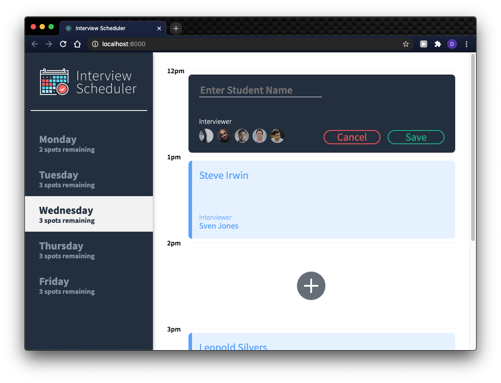
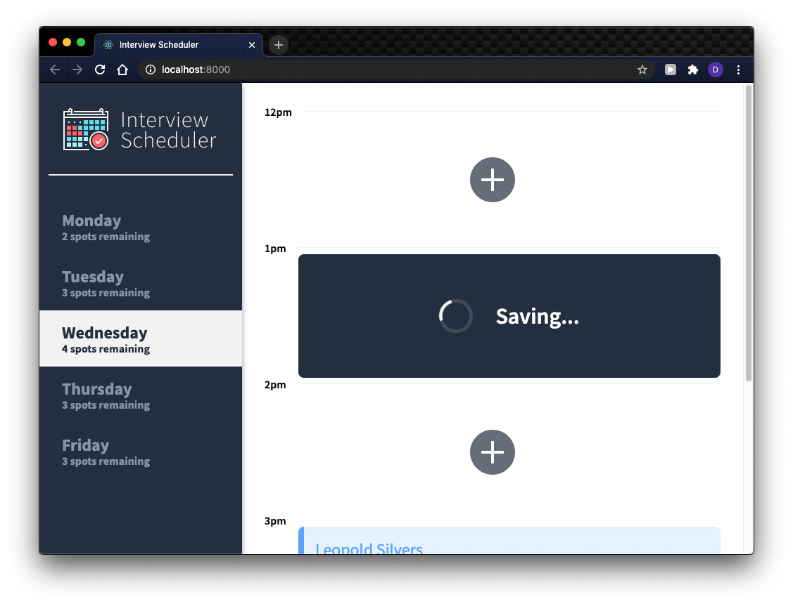
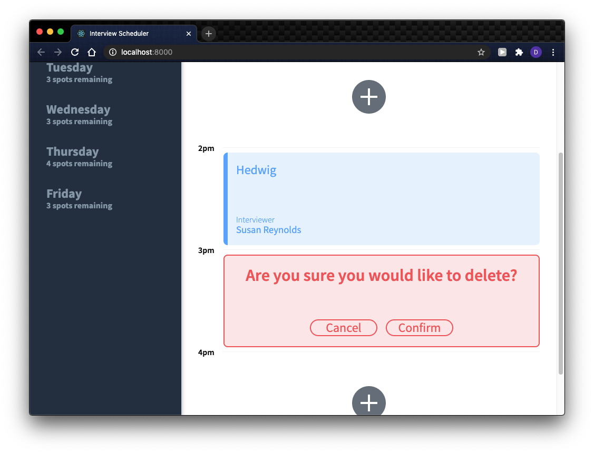
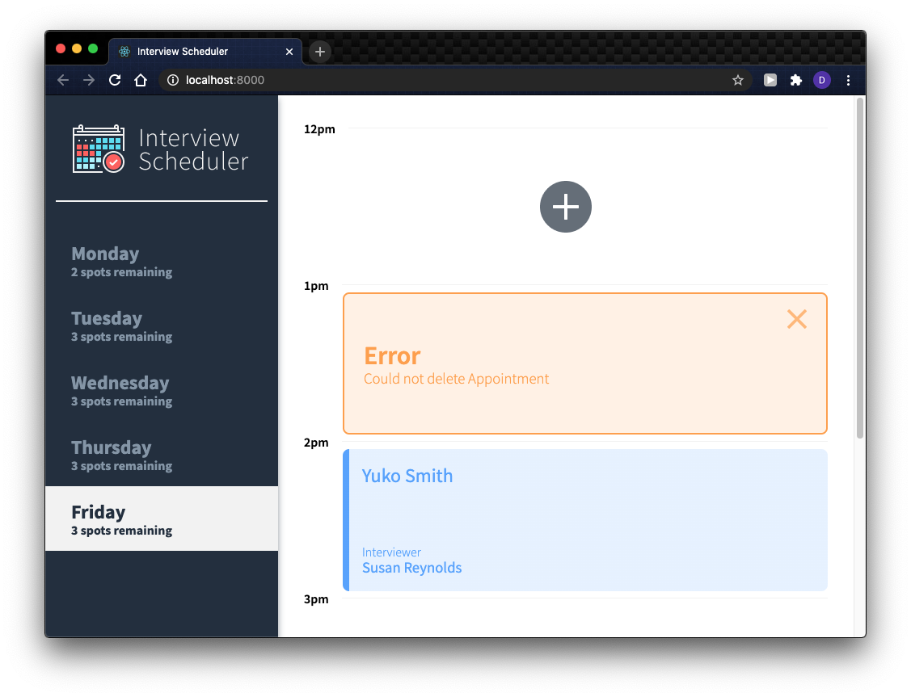

# Interview Scheduler

## A React-based web app that lets the user create, edit, delete appointments. 


## Setup

Install dependencies with `npm install`.

## Running Webpack Development Server

```sh
npm start
```

## Running Jest Test Framework

```sh
npm test
```

## Running Storybook Visual Testbed

```sh
npm run storybook
```

## Dependencies

- `axios`
- `testing-library/react-hooks`
- `react-test-renderer`

## Screenshots





